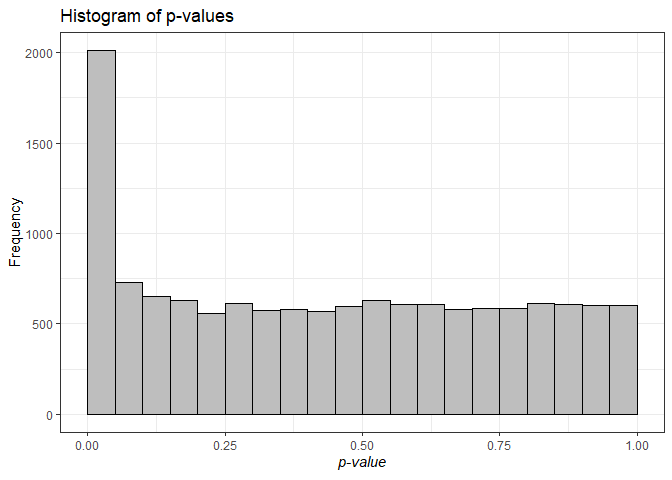
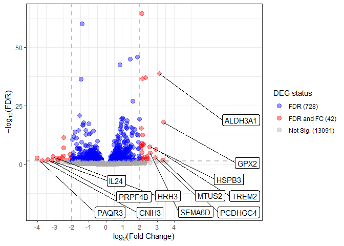
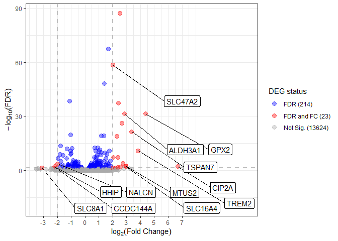
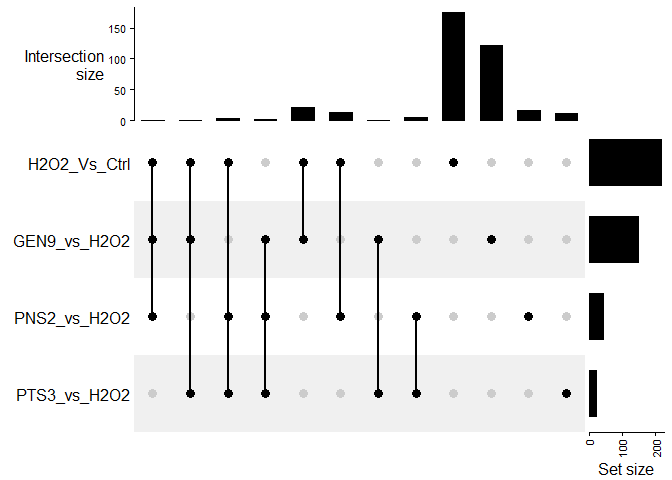

DEG
================
Marco Tello
2024-08-21

# DEG visualization and comparison

We load the results from the differential expression analysis using
DESeq2. The file contains 7 columns:

ENSG: ENSEMBL Gene Identifier baseMean: Mean expression across samples
log2FoldChange: Change in expression in the experimental condition vs
control condition lfcSE: stat: pvalue: Probability of observing a change
in expression as extreme as “stat” assuming there were no changes
between conditions padj: Pvalue adjusted for multiple testing using FDR
Group: Comparison group label \[Experimental condition\]\_Vs\[Control
condition\]. Possible values: “H2O2_Vs_Ctrl” “GEN9_vs_H2O2”
“PNS2_vs_H2O2” “PTS3_vs_H2O2”

``` r
degs <- fread("~/GitHub/RNAseq_PECs/data/DEG_results.tsv")
head(degs)
```

    ##                  ENSG   baseMean log2FoldChange     lfcSE       stat
    ##                <char>      <num>          <num>     <num>      <num>
    ## 1: ENSG00000000003.16  109.06177     -0.8003105 0.4567391 -1.7522269
    ## 2: ENSG00000000419.14  477.63579     -0.6654497 0.2049411 -3.2470296
    ## 3: ENSG00000000457.14  135.61265     -0.9635251 0.4357639 -2.2111175
    ## 4: ENSG00000000460.17   61.77891      0.6639780 0.2981451  2.2270300
    ## 5: ENSG00000001036.14  571.51155     -0.3572769 0.4388842 -0.8140574
    ## 6: ENSG00000001084.13 2165.87191     -0.7603788 0.3698795 -2.0557472
    ##         pvalue       padj        Group
    ##          <num>      <num>       <char>
    ## 1: 0.079734807 0.24890053 H2O2_Vs_Ctrl
    ## 2: 0.001166163 0.01436607 H2O2_Vs_Ctrl
    ## 3: 0.027027704 0.13287116 H2O2_Vs_Ctrl
    ## 4: 0.025945269 0.12925902 H2O2_Vs_Ctrl
    ## 5: 0.415612092 0.63474595 H2O2_Vs_Ctrl
    ## 6: 0.039806890 0.16469878 H2O2_Vs_Ctrl

## Individual differential expression profiles.

We will first visualize DEGs by group using volcano plots. We will
define DEGs as follow:

``` r
alpha <- 0.05
log2FC <- 2
```

### H2O2_Vs_Ctrl

First we will visualize the changes in expression comparing exposure to
H2O2 vs control condition.

We will first generate a histogram of the raw p-values for all genes. If
the H0 is true, we would expect to see an uniform distribution of
pvalues. A peak at low zeroes indicate we reject the H0.

``` r
temp <- visualize_degs(degs[Group == "H2O2_Vs_Ctrl"], alpha, log2FC)
temp[[1]]
```

<!-- --> Then
we visualize the expression changes using a volcano plot.

``` r
temp[[2]]
```

<!-- -->

### GEN9_vs_H2O2

First we will visualize the changes in expression comparing exposure to
H2O2 vs control condition.

We will first generate a histogram of the raw p-values for all genes. If
the H0 is true, we would expect to see an uniform distribution of
pvalues. A peak at low zeroes indicate we reject the H0.

``` r
temp <- visualize_degs(degs[Group == "GEN9_vs_H2O2"], alpha, log2FC)
temp[[1]]
```

<!-- --> Then
we visualize the expression changes using a volcano plot.

``` r
temp[[2]]
```

<!-- -->

### PNS2_vs_H2O2

First we will visualize the changes in expression comparing exposure to
H2O2 vs control condition.

We will first generate a histogram of the raw p-values for all genes. If
the H0 is true, we would expect to see an uniform distribution of
pvalues. A peak at low zeroes indicate we reject the H0.

``` r
temp <- visualize_degs(degs[Group == "PNS2_vs_H2O2"], alpha, log2FC)
temp[[1]]
```

<!-- --> Then
we visualize the expression changes using a volcano plot.

``` r
temp[[2]]
```

<!-- -->

### PTS3_vs_H2O2

First we will visualize the changes in expression comparing exposure to
H2O2 vs control condition.

We will first generate a histogram of the raw p-values for all genes. If
the H0 is true, we would expect to see an uniform distribution of
pvalues. A peak at low zeroes indicate we reject the H0.

``` r
temp <- visualize_degs(degs[Group == "PTS3_vs_H2O2"], alpha, log2FC)
temp[[1]]
```

<!-- --> Then
we visualize the expression changes using a volcano plot.

``` r
temp[[2]]
```

<!-- -->

### TODO: Explore samples in the conditions PTS3 and H2O2. Are ther a lot of genes with zero reads that scape filtering step?

## Visualize shared set of DEGs

Based on our final selection of FDR and Fold Change cutoffs we will
determine what genes are shared across conditions using an upset plot.

``` r
degs_sig <- degs[padj < alpha & abs(log2FoldChange) >= log2FC]

gene_mat <- dcast(data = degs_sig[, .(value = 1), by = .(ENSG, Group)], 
                formula = ENSG ~ Group, 
                value.var = "value", 
                fill = 0)
gene_mat <- as.matrix(gene_mat[, .SD, .SDcols = !"ENSG"], rownames = gene_mat$ENSG)

# Possible modes: 
# "distinct", "intersect", "union"
comb_mat <- make_comb_mat(gene_mat, mode = "distinct")
UpSet(comb_mat)
```

<!-- -->
Based on the UpSet plot, we can determine the genes that potentially
could have reversed their expression change.

``` r
# Binary order:
# GEN9, H2O2, PNS2, PTS3
candidate_genes <- extract_comb(comb_mat, "1110")
for(combination in c("1101","0111","1100","0110")){
  candidate_genes <- unique(c(candidate_genes, extract_comb(comb_mat, combination)))
}
candidate_genes
```

    ##  [1] "ENSG00000133661.17" "ENSG00000168679.18" "ENSG00000108602.18"
    ##  [4] "ENSG00000132938.22" "ENSG00000180638.19" "ENSG00000213033.4" 
    ##  [7] "ENSG00000051382.9"  "ENSG00000076258.10" "ENSG00000086848.15"
    ## [10] "ENSG00000100612.14" "ENSG00000100985.7"  "ENSG00000101844.18"
    ## [13] "ENSG00000105825.14" "ENSG00000108654.16" "ENSG00000115461.5" 
    ## [16] "ENSG00000119041.11" "ENSG00000121552.4"  "ENSG00000124256.15"
    ## [19] "ENSG00000126709.16" "ENSG00000134326.12" "ENSG00000157601.15"
    ## [22] "ENSG00000164331.10" "ENSG00000165799.5"  "ENSG00000165949.13"
    ## [25] "ENSG00000168874.13" "ENSG00000168961.17" "ENSG00000183486.14"
    ## [28] "ENSG00000196684.12" "ENSG00000101180.17" "ENSG00000101825.8" 
    ## [31] "ENSG00000109794.14" "ENSG00000132386.11" "ENSG00000137872.17"
    ## [34] "ENSG00000145147.20" "ENSG00000145824.13" "ENSG00000162892.16"
    ## [37] "ENSG00000169271.3"  "ENSG00000171227.7"  "ENSG00000171346.16"
    ## [40] "ENSG00000171873.8"  "ENSG00000197406.8"  "ENSG00000215861.9" 
    ## [43] "ENSG00000227507.3"

## Determine if genes reverted expression change

We start with the most simple scenario where any gene that showed a
change of expression in H2O2 vs Control AND Treatment vs H2O2 is
considered for the analysis.

``` r
temp <- degs[ENSG %in% candidate_genes, .SD, .SDcols = c("ENSG", "log2FoldChange", "Group")]

temp <- dcast(temp, ENSG ~ Group, value.var = "log2FoldChange")

head(temp)
```

    ## Key: <ENSG>
    ##                  ENSG GEN9_vs_H2O2 H2O2_Vs_Ctrl PNS2_vs_H2O2 PTS3_vs_H2O2
    ##                <char>        <num>        <num>        <num>        <num>
    ## 1:  ENSG00000051382.9     2.185152    -2.320552    1.0326540    0.4654440
    ## 2: ENSG00000076258.10     2.236237    -2.762390    2.1732858    1.0137570
    ## 3: ENSG00000086848.15     2.459476    -2.438430    0.8056513   -0.5174692
    ## 4: ENSG00000100612.14     3.131002    -2.854015    0.4538895    1.1841477
    ## 5:  ENSG00000100985.7    -2.263243     3.902613   -1.5778570   -0.5691665
    ## 6: ENSG00000101180.17    -1.169204     3.392607   -3.1101970   -1.8626458

``` r
head(temp[, H2O2_Vs_Ctrl + .SD, .SDcols = c("GEN9_vs_H2O2", "PNS2_vs_H2O2", "PTS3_vs_H2O2"), by = "ENSG"])
```

    ## Key: <ENSG>
    ##                  ENSG GEN9_vs_H2O2 PNS2_vs_H2O2 PTS3_vs_H2O2
    ##                <char>        <num>        <num>        <num>
    ## 1:  ENSG00000051382.9  -0.13540023   -1.2878979    -1.855108
    ## 2: ENSG00000076258.10  -0.52615250   -0.5891039    -1.748633
    ## 3: ENSG00000086848.15   0.02104568   -1.6327787    -2.955899
    ## 4: ENSG00000100612.14   0.27698781   -2.4001252    -1.669867
    ## 5:  ENSG00000100985.7   1.63937055    2.3247562     3.333447
    ## 6: ENSG00000101180.17   2.22340320    0.2824099     1.529961
