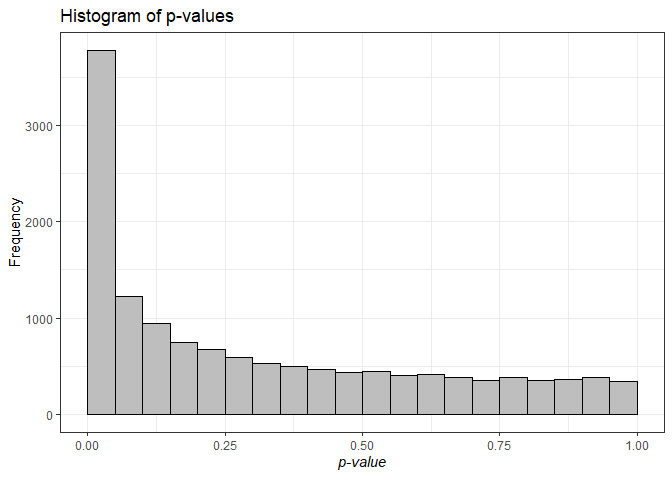
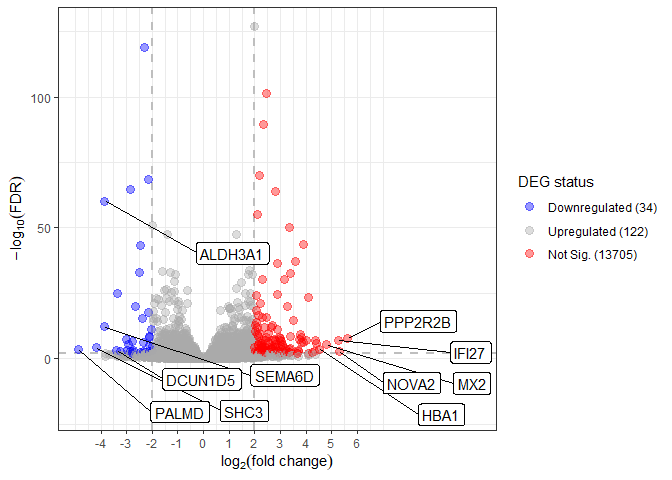
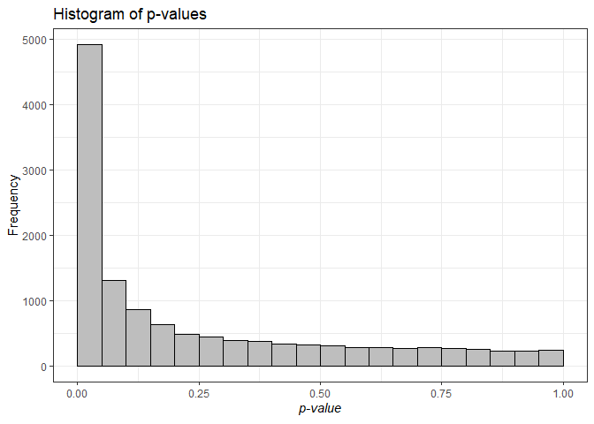
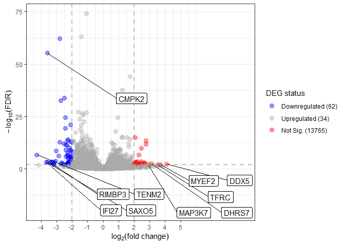
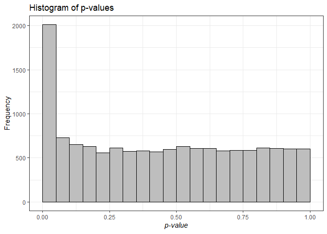
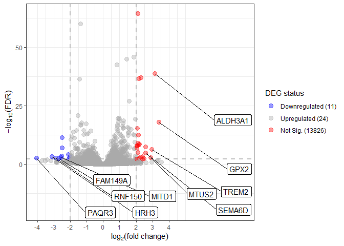
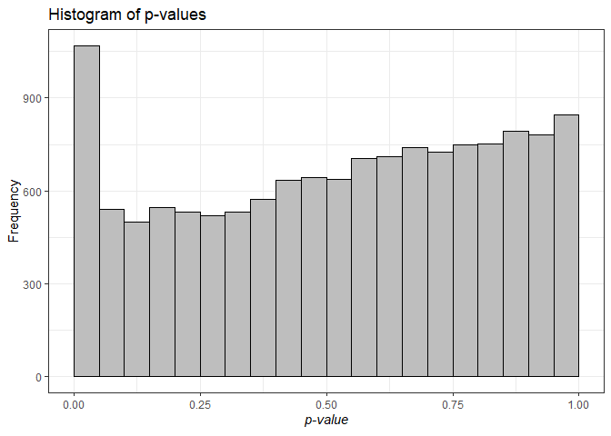
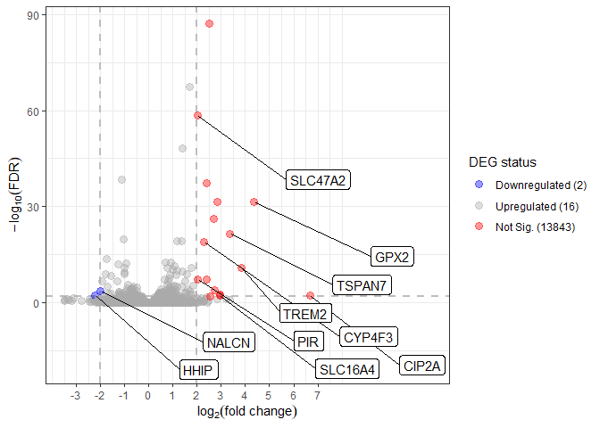
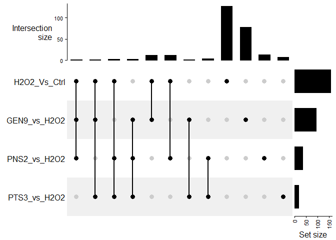
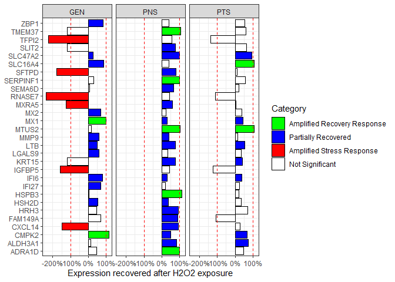

DEG
================
Marco Tello
2024-08-21

# DEG visualization and comparison

We load the results from the differential expression analysis using
DESeq2. The file contains 7 columns:

ENSG: ENSEMBL Gene Identifier baseMean: Mean expression across samples
log2FoldChange: Change in expression in the experimental condition vs
control condition lfcSE: stat: pvalue: Probability of observing a change
in expression as extreme as “stat” assuming there were no changes
between conditions padj: Pvalue adjusted for multiple testing using FDR
Group: Comparison group label \[Experimental condition\]\_Vs\[Control
condition\]. Possible values: “H2O2_Vs_Ctrl” “GEN9_vs_H2O2”
“PNS2_vs_H2O2” “PTS3_vs_H2O2”

``` r
degs <- fread("~/GitHub/RNAseq_PECs/data/DEG_results.tsv")
exp_data <- fread("~/GitHub/RNAseq_PECs/data/filtered_counts.tsv")
exp_data <- merge.data.table(x = degs[,.SD, .SDcols = c("ensembl_gene_id_version", 
                                                        "external_gene_name",
                                                        "entrezgene_id")], 
                             y = exp_data, 
                             by.x = "ensembl_gene_id_version", 
                             by.y = "ENSG", 
                             all.y = TRUE)
exp_data <- unique(exp_data)

vst_counts <- DESeq2::varianceStabilizingTransformation(as.matrix(exp_data[, 4:ncol(exp_data)]))
vst_counts <- cbind(exp_data[,1:3], data.table(vst_counts))

head(degs)
```

    ##    ensembl_gene_id_version external_gene_name entrezgene_id   baseMean
    ##                     <char>             <char>         <int>      <num>
    ## 1:      ENSG00000000003.16             TSPAN6          7105  109.06177
    ## 2:      ENSG00000000419.14               DPM1          8813  477.63579
    ## 3:      ENSG00000000457.14              SCYL3         57147  135.61265
    ## 4:      ENSG00000000460.17              FIRRM         55732   61.77891
    ## 5:      ENSG00000001036.14              FUCA2          2519  571.51155
    ## 6:      ENSG00000001084.13               GCLC          2729 2165.87191
    ##    log2FoldChange     lfcSE       stat       pvalue        padj        Group
    ##             <num>     <num>      <num>        <num>       <num>       <char>
    ## 1:      0.9130062 0.4562040  2.0013114 4.535884e-02 0.124210936 GEN9_vs_H2O2
    ## 2:      0.6355174 0.2049449  3.1009177 1.929219e-03 0.016734206 GEN9_vs_H2O2
    ## 3:      1.2061004 0.4352151  2.7712739 5.583744e-03 0.033946820 GEN9_vs_H2O2
    ## 4:     -0.2658402 0.2930954 -0.9070089 3.644021e-01 0.509202422 GEN9_vs_H2O2
    ## 5:      1.0618681 0.4383234  2.4225673 1.541127e-02 0.062782878 GEN9_vs_H2O2
    ## 6:      1.5591239 0.3696058  4.2183426 2.461047e-05 0.000595232 GEN9_vs_H2O2

``` r
head(vst_counts)
```

    ## Key: <ensembl_gene_id_version>
    ##    ensembl_gene_id_version external_gene_name entrezgene_id    Ctrl_1   Ctrl_2
    ##                     <char>             <char>         <int>     <num>    <num>
    ## 1:      ENSG00000000003.16             TSPAN6          7105  8.083636 6.756762
    ## 2:      ENSG00000000419.14               DPM1          8813  9.174522 8.994993
    ## 3:      ENSG00000000457.14              SCYL3         57147  7.953442 7.314346
    ## 4:      ENSG00000000460.17              FIRRM         55732  7.275736 5.891072
    ## 5:      ENSG00000001036.14              FUCA2          2519 10.016318 8.461632
    ## 6:      ENSG00000001084.13               GCLC          2729 10.751171 9.889772
    ##      Ctrl_3    GEN9_1    GEN9_2    GEN9_3   H2O2_1   H2O2_2   H2O2_3    PNS2_1
    ##       <num>     <num>     <num>     <num>    <num>    <num>    <num>     <num>
    ## 1: 6.659131  6.774156  7.178738  8.053284 6.760988 6.701313 6.636030  6.590478
    ## 2: 9.381541  8.803451  9.319519  9.282378 8.422632 8.825451 8.474910  8.824313
    ## 3: 6.983700  7.331151  7.512982  7.977976 6.745628 7.303896 6.485995  7.451163
    ## 4: 5.780273  6.114705  6.101699  7.435062 6.454961 6.846195 6.281608  6.081897
    ## 5: 8.327911  9.344057  9.460396 10.468868 8.639543 9.169327 8.703166  8.843587
    ## 6: 9.880074 10.688212 10.852715 11.310879 9.567506 9.823417 9.736677 11.102266
    ##       PNS2_2    PNS2_3    PTS3_1    PTS3_2    PTS3_3
    ##        <num>     <num>     <num>     <num>     <num>
    ## 1:  6.486279  6.680360  7.074711  6.672181  6.795979
    ## 2:  8.885595  8.772471  9.113344  8.983940  8.676050
    ## 3:  6.671966  7.236682  6.580058  6.918006  6.951828
    ## 4:  5.844455  6.067559  6.505849  6.146146  6.620745
    ## 5:  8.725895  9.227242  8.745315  9.110343  8.916862
    ## 6: 11.272931 11.308030 12.080725 12.092013 12.034843

## Individual differential expression profiles.

We will first visualize DEGs by group using volcano plots. We will
define DEGs as follow:

``` r
alpha <- 0.01
log2FC <- 2
```

### H2O2_Vs_Ctrl

First we will visualize the changes in expression comparing exposure to
H2O2 vs control condition.

We will first generate a histogram of the raw p-values for all genes. If
the H0 is true, we would expect to see an uniform distribution of
pvalues. A peak at low zeroes indicate we reject the H0.

``` r
temp <- visualize_degs(degs[Group == "H2O2_Vs_Ctrl"], alpha, log2FC, top_exp = 5)
temp[[1]]
```

<!-- -->
Then we visualize the expression changes using a volcano plot.

``` r
temp[[2]]
```

<!-- -->

### GEN9_vs_H2O2

First we will visualize the changes in expression comparing exposure to
H2O2 vs control condition.

We will first generate a histogram of the raw p-values for all genes. If
the H0 is true, we would expect to see an uniform distribution of
pvalues. A peak at low zeroes indicate we reject the H0.

``` r
temp <- visualize_degs(degs[Group == "GEN9_vs_H2O2"], alpha, log2FC)
temp[[1]]
```

<!-- -->
Then we visualize the expression changes using a volcano plot.

``` r
temp[[2]]
```

<!-- -->

### PNS2_vs_H2O2

First we will visualize the changes in expression comparing exposure to
H2O2 vs control condition.

We will first generate a histogram of the raw p-values for all genes. If
the H0 is true, we would expect to see an uniform distribution of
pvalues. A peak at low zeroes indicate we reject the H0.

``` r
temp <- visualize_degs(degs[Group == "PNS2_vs_H2O2"], alpha, log2FC)
temp[[1]]
```

<!-- -->
Then we visualize the expression changes using a volcano plot.

``` r
temp[[2]]
```

<!-- -->

### PTS3_vs_H2O2

First we will visualize the changes in expression comparing exposure to
H2O2 vs control condition.

We will first generate a histogram of the raw p-values for all genes. If
the H0 is true, we would expect to see an uniform distribution of
pvalues. A peak at low zeroes indicate we reject the H0.

``` r
temp <- visualize_degs(degs[Group == "PTS3_vs_H2O2"], alpha, log2FC)
temp[[1]]
```

<!-- -->
Then we visualize the expression changes using a volcano plot.

``` r
temp[[2]]
```

<!-- -->

### TODO: Explore samples in the conditions PTS3 and H2O2. Are ther a lot of genes with zero reads that scape filtering step?

## Visualize shared set of DEGs

Based on our final selection of FDR and Fold Change cutoffs we will
determine what genes are shared across conditions using an upset plot.

``` r
# Select for DEGs based on alpha and log2FC
degs_sig <- degs[padj < alpha & abs(log2FoldChange) >= log2FC]
# Reshape data.table
gene_mat <- dcast(data = degs_sig[, .(value = 1), 
                                  by = .(ensembl_gene_id_version, Group)], 
                formula = ensembl_gene_id_version ~ Group, 
                value.var = "value", 
                fill = 0)
# Convert to matrix for compatibility with UpSet
gene_mat <- as.matrix(gene_mat[, .SD, .SDcols = !"ensembl_gene_id_version"], rownames = gene_mat$ensembl_gene_id_version)

# Possible modes: 
# "distinct" (default), "intersect", "union"
comb_mat <- make_comb_mat(gene_mat, mode = "distinct")
UpSet(comb_mat)
```

<!-- -->

Based on the UpSet plot, we can determine the genes that potentially
could have reversed their expression change.

``` r
# Binary order:
# GEN9, H2O2, PNS2, PTS3
candidate_genes <- extract_comb(comb_mat, "1110")
for(combination in c("1101","0111","1100","0110")){
  candidate_genes <- unique(c(candidate_genes, extract_comb(comb_mat, combination)))
}
candidate_genes
```

    ##  [1] "ENSG00000133661.17" "ENSG00000168679.18" "ENSG00000108602.18"
    ##  [4] "ENSG00000132938.22" "ENSG00000180638.19" "ENSG00000100985.7" 
    ##  [7] "ENSG00000105825.14" "ENSG00000115461.5"  "ENSG00000124256.15"
    ## [10] "ENSG00000126709.16" "ENSG00000134326.12" "ENSG00000157601.15"
    ## [13] "ENSG00000165799.5"  "ENSG00000165949.13" "ENSG00000168961.17"
    ## [16] "ENSG00000183486.14" "ENSG00000196684.12" "ENSG00000101180.17"
    ## [19] "ENSG00000101825.8"  "ENSG00000109794.14" "ENSG00000132386.11"
    ## [22] "ENSG00000137872.17" "ENSG00000145147.20" "ENSG00000145824.13"
    ## [25] "ENSG00000169271.3"  "ENSG00000171227.7"  "ENSG00000171346.16"
    ## [28] "ENSG00000171873.8"  "ENSG00000227507.3"

## Determine if genes reverted expression change

We start with the most simple scenario where any gene that showed a
change of expression in H2O2 vs Control AND Treatment vs H2O2 is
considered for the analysis.

``` r
candidate_exp <- vst_counts[ensembl_gene_id_version %in% candidate_genes]
candidate_exp[, ensembl_gene_id_version := NULL]
candidate_exp[, entrezgene_id := NULL]
candidate_exp <- melt(candidate_exp, 
                      id.vars = "external_gene_name", 
                      variable.name = "Group", 
                      value.name = "ExpCount")

candidate_exp[, Group := str_replace(Group, "_[1-3]", "")]
candidate_exp[, Group := factor(Group, 
                                levels = c("Ctrl", "H2O2", 
                                           "GEN9", "PNS2", 
                                           "PTS3"))]
candidate_exp <- candidate_exp[, .(mean_exp = mean(ExpCount)), by = c("external_gene_name", "Group")]
setkey(candidate_exp, "external_gene_name")
```

``` r
temp <- dcast(candidate_exp, external_gene_name ~ Group, value.var = "mean_exp")
temp <- temp[, .(baseline = H2O2 - Ctrl, 
                 DGEN9 = H2O2 - GEN9, 
                 DPNS2 = H2O2 - PNS2, 
                 DPTS3 = H2O2 - PTS3), 
             by = external_gene_name]
temp <- temp[, .(GEN9_vs_H2O2 = round(DGEN9/baseline*100, 2),
                 PNS2_vs_H2O2 = round(DPNS2/baseline*100, 2), 
                 PTS3_vs_H2O2 = round(DPTS3/baseline*100, 2)), 
             by = external_gene_name]
temp <- melt(temp, 
             id.vars = "external_gene_name", 
             variable.name = "Group", 
             value.name = "Recovery")
temp[, Recovery := ifelse(Recovery < 0, Recovery - 100, Recovery)]

setkeyv(degs, c("external_gene_name", "Group"))
deg_status <- degs[temp[, .SD, 
                        .SDcols = c("external_gene_name", "Group")],
                   .(external_gene_name, 
                     Group, 
                     FDR = ifelse(padj < alpha, TRUE, FALSE))]
temp <- merge.data.table(temp, deg_status)
temp[, Category := ifelse(FDR == FALSE | is.na(FDR), 
                          "Not Significant", 
                          ifelse(Recovery < 0, 
                                 "Amplified Stress Response", 
                                 ifelse(Recovery < 100, 
                                        "Partially Recovered", 
                                        "Amplified Recovery Response")))]

temp[, Category := factor(Category, levels = c("Amplified Recovery Response", "Partially Recovered", "Amplified Stress Response", "Not Significant"))]
temp[, Group := str_replace(Group, "[0-9]_vs_H2O2", "")]
exp_percent <- temp
```

``` r
ggplot(exp_percent, 
       aes(y = external_gene_name, 
           x = Recovery, 
           fill = Category)) +
  geom_bar(stat = "identity", color = "black", 
           position = position_dodge()) + 
  geom_vline(xintercept = c(100, -100), 
             colour = "red", linetype = "dashed")+
  scale_fill_manual(values = c("green", "blue", "red", "white")) +
  theme_bw() +
  facet_grid(~Group) +
  scale_x_continuous(labels = label_percent(scale = 1))+
  labs(x = "Expression recovered after H2O2 exposure", y = NULL)
```

<!-- -->
