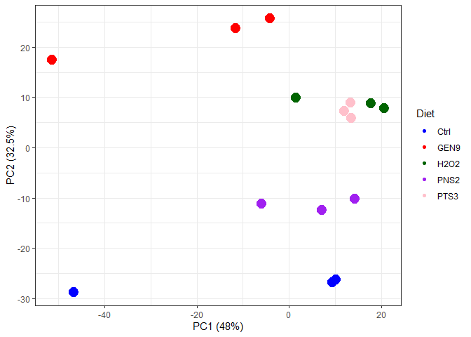

EDA
================
Marco Tello
2024-02-22

# Exploratory Data Analysis

The goal is to explore if:

- Are there any outlier samples?

- Are the count distributions are similar across all samples?

- Do gene expression variability aligns with experimental conditions?

## Count distribution

``` r
# Read count table
# We remove last sample which is not properly identified
count_df <- read.table(file.path(data_path, "Salmon_EstCount_ENSG.tsv"), 
                       header = TRUE) 

count_df %>%
  head()
```

    ##                 ENSG  Ctrl_1  Ctrl_2  Ctrl_3  GEN9_1  GEN9_2  GEN9_3  H2O2_1
    ## 1 ENSG00000000003.16 286.513  90.259  72.215 104.211 127.029 233.512  76.313
    ## 2  ENSG00000000005.6   0.000   0.000   0.000   0.000   0.000   0.000   0.000
    ## 3 ENSG00000000419.14 640.854 510.415 587.028 504.972 639.062 578.086 281.934
    ## 4 ENSG00000000457.14 259.760 142.849  94.973 164.791 166.018 221.015  74.532
    ## 5 ENSG00000000460.17 153.036  39.680  30.645  56.586  49.387 145.131  58.358
    ## 6 ENSG00000000938.13  44.579  22.211  54.137  18.000   9.000   3.000   0.000
    ##    H2O2_2  H2O2_3  PNS2_1  PNS2_2  PNS2_3  PTS3_1  PTS3_2  PTS3_3
    ## 1  98.322  80.088  60.712  67.265  73.822 119.274  81.198  85.361
    ## 2   0.000   0.000   0.000   0.000   0.000   0.000   0.000   0.000
    ## 3 514.540 344.390 353.199 445.463 381.360 562.103 490.200 368.840
    ## 4 161.960  69.765 124.925  78.977 118.479  77.924  99.779  96.941
    ## 5 111.007  58.060  38.249  35.883  41.755  72.505  50.230  72.524
    ## 6  37.117  12.409  13.540   0.000  20.366   0.000   6.936   0.000

By looking at the density plots of the expression data it is possible to
determine if any sample is a clear outlier.

``` r
count_df %>%
  pivot_longer(!ENSG) %>%
  ggplot(aes(x=value, color = name)) +
    geom_density() +
    scale_x_continuous(trans = 'log10', labels = scales::comma)
```

    ## Warning in scale_x_continuous(trans = "log10", labels = scales::comma): log-10
    ## transformation introduced infinite values.

    ## Warning: Removed 254452 rows containing non-finite outside the scale range
    ## (`stat_density()`).

<!-- -->

``` r
temp <- count_df %>%
  pivot_longer(!ENSG) %>%
  mutate(condition = str_replace(string = name, 
                                 pattern = "_\\d", 
                                 replacement = "")) %>%
  mutate(condition = case_when(
    condition == "Ctrl" ~ "blue",
    condition == "GEN9" ~ "red",
    condition == "H2O2" ~ "darkgreen",
    condition == "PNS2" ~ "purple",
    condition == "PTS3" ~ "pink"))


temp %>%
  ggplot(aes(x=value, color= name))+
  geom_density() +
  scale_x_continuous(trans = 'log10', labels = scales::comma) +
  scale_color_manual(values = temp$condition, 
                     breaks = temp$name) 
```

    ## Warning in scale_x_continuous(trans = "log10", labels = scales::comma): log-10
    ## transformation introduced infinite values.

    ## Warning: Removed 254452 rows containing non-finite outside the scale range
    ## (`stat_density()`).

<!-- -->

We can observe that one control sample and one sample from the Gen9
group have slightly more counts than other samples.

### Filter lowly expressed genes

To increase data quality we removed lowly expressed genes in two steps:

1.  Removed genes with no counts across all samples.

``` r
# Remove columns with gene information 
exp_mat <- count_df %>%
  column_to_rownames("ENSG")
# Remove rows with all entries equal zero
exp_mat <- exp_mat[!(rowSums(exp_mat == 0) == ncol(exp_mat)),]
```

2.  Removed genes with less than two reads in more than 12 samples.

``` r
# We use the average 1st quartile as threshold (2.1), round down to 2
# floor(mean(apply(exp_mat, MARGIN = 2, quantile, 0.25)))

# Select genes to keep
min_reads <- 1
min_samples <- 12
genes_to_keep <- apply(exp_mat >= min_reads, 
                       MARGIN = 1, sum) > min_samples

# Final gene count matrix
exp_mat <- exp_mat[genes_to_keep,]
```

Now we repeat the previous visualizations to explore how the count
distributions changed after filtering

``` r
exp_mat %>%
  rownames_to_column("ENSG") %>%
  pivot_longer(!ENSG) %>%
  ggplot(aes(x=value, color = name)) +
    geom_density() +
    scale_x_continuous(trans = 'log10', labels = scales::comma)
```

<!-- -->

``` r
temp <- exp_mat %>%
  rownames_to_column("ENSG") %>%
  pivot_longer(!ENSG) %>%
  mutate(condition = str_replace(string = name, 
                                 pattern = "_\\d", 
                                 replacement = "")) %>%
  mutate(condition = case_when(
    condition == "Ctrl" ~ "blue",
    condition == "GEN9" ~ "red",
    condition == "H2O2" ~ "darkgreen",
    condition == "PNS2" ~ "purple",
    condition == "PTS3" ~ "pink"))


temp %>%
  ggplot(aes(x=value, color= name))+
  geom_density() +
  scale_x_continuous(trans = 'log10', labels = scales::comma) +
  scale_color_manual(values = temp$condition, 
                     breaks = temp$name) 
```

    ## Warning in scale_x_continuous(trans = "log10", labels = scales::comma): log-10
    ## transformation introduced infinite values.

    ## Warning: Removed 1642 rows containing non-finite outside the scale range
    ## (`stat_density()`).

<!-- -->

This step made samples distributions to look mostly normal on the log10
scale.

## CPM normalization

Before proceeding to further analysis we need to normalize the gene
counts, we will use *counts per million* (CPM) to adjust for library
size and transform it to log space for better visualization.

``` r
# CPM normalization and transform to log2
expr_log2cpm <- cpm(exp_mat, 
                    log = TRUE, 
                    prior.count = 1) %>% 
  data.frame() 

expr_log2cpm %>%
  rownames_to_column(var = "GeneSymbol") %>%
  pivot_longer(!GeneSymbol) %>%
  dplyr::select(!GeneSymbol) %>%
  ggplot(aes(x=value, color= name))+
  geom_density() 
```

<!-- -->

### Violin plots

To directly compare sample gene expression distribution without overlap
between density plots we generated the respective violin plots

``` r
temp <- expr_log2cpm %>%
  rownames_to_column(var="GeneSymbol") %>%
  pivot_longer(!GeneSymbol) %>%
  dplyr::select(!GeneSymbol) %>%
  mutate(condition = str_replace(string = name, 
                                 pattern = "_\\d+", 
                                 replacement = "")) 
# Convert condition to factor 
temp <- temp %>%
  mutate(condition = factor(condition, 
                            levels =c("Ctrl","GEN9","H2O2","PNS2","PTS3")))

# Plot using ggplot with correct fill mapping
temp %>%
  ggplot(aes(x=name, y=value, fill = condition)) +
  geom_violin()+
  scale_fill_manual(values = c("Ctrl" = "blue", 
                               "GEN9" = "red", 
                               "H2O2" = "darkgreen", 
                               "PNS2" = "purple",
                               "PTS3" = "pink")) +
  theme(axis.text.x = element_text(angle = 45, hjust=1))
```

<!-- -->

Utilizing log10(CPM) values we can observe that all samples have similar
expression distributions.

### Sample-sample correlation plot

Using normalized counts we generated a plot to observe if there is
correlation within diet groups which would group the samples
accordingly.

``` r
# Annotation

# Standardize conditon names
condition <- names(expr_log2cpm) %>% 
  str_replace(pattern = "_\\d+", 
              replacement = "")

annot <- data.frame(Diet = as.factor(condition),
                    row.names = names(expr_log2cpm))

annot_colors <- list(Diet = c("Ctrl" = "blue", 
                               "GEN9" = "red", 
                               "H2O2" = "darkgreen", 
                               "PNS2" = "purple",
                               "PTS3" = "pink"))

# Heatmap            
expr_log2cpm %>%
  cor() %>%
  pheatmap(annotation_col = annot,
           annotation_row = annot,
           show_rownames = FALSE, 
           annotation_colors = annot_colors, 
           angle_col = 45)
```

<!-- -->

### Principal Component Analysis (PCA)

Another way of determining relationship between the samples is through a
PCA analysis, which reduces the dimentionality of our data to a set of
independent variables (principal components) that represent the major
proportion of variability in our data.

``` r
PCs <- prcomp(t(cpm(exp_mat)), center = TRUE, scale = TRUE)
# Scree plot 
fviz_eig(PCs)
```

<!-- -->

``` r
# Scatter plot
eig_val <- get_eigenvalue(PCs)
PCs <- cbind(annot, PCs$x[,1:10])
PCs$sample_id <- rownames(PCs)

PCs <- PCs %>%
  mutate(color_class = case_when(
    condition == "Ctrl" ~ "blue",
    condition == "GEN9" ~ "red",
    condition == "H2O2" ~ "darkgreen",
    condition == "PNS2" ~ "purple",
    condition == "PTS3" ~ "pink")) 

PCs %>%
  ggplot(aes(x = PC1, y = PC2, 
             color = Diet)) + 
  geom_point(aes(size = 8)) + 
  scale_color_manual(values = PCs$color_class, 
                     breaks = PCs$Diet) +
  labs(x= paste("PC1 (",round(eig_val$variance.percent[1], 2),"%)", sep = ""),
       y= paste("PC2 (",round(eig_val$variance.percent[2], 2),"%)", sep = ""))+
  guides(size = "none") +
  theme_bw()
```

<!-- -->

#### Clustering and PCA on top variable genes

For scenarios where experimental variability is expected to be low, it
is worth looking at genes with the highest overall variability. If we
expect a few differentially expressed genes, the signal is likely to get
lost among many genes with no expression changes.

``` r
temp <- exp_mat

#Top 1000 variable
index <- which( rownames(temp) %in% names(sort(apply(X = temp, MARGIN = 1, var), decreasing = TRUE)[1:1000]))
temp <- temp[index,]

PCs <- prcomp(t(cpm(temp)), center = TRUE, scale = TRUE)
# Scree plot 
fviz_eig(PCs)
```

<!-- -->

``` r
# Scatter plot
eig_val <- get_eigenvalue(PCs)
PCs <- cbind(annot, PCs$x[,1:10])
PCs$sample_id <- rownames(PCs)

PCs <- PCs %>%
  mutate(color_class = case_when(
    condition == "Ctrl" ~ "blue",
    condition == "GEN9" ~ "red",
    condition == "H2O2" ~ "darkgreen",
    condition == "PNS2" ~ "purple",
    condition == "PTS3" ~ "pink")) 

PCs %>%
  ggplot(aes(x = PC1, y = PC2, 
             color = Diet)) + 
  geom_point(aes(size = 8)) + 
  scale_color_manual(values = PCs$color_class, 
                     breaks = PCs$Diet) +
  labs(x= paste("PC1 (",round(eig_val$variance.percent[1], 2),"%)", sep = ""),
       y= paste("PC2 (",round(eig_val$variance.percent[2], 2),"%)", sep = ""))+
  guides(size = "none") +
  theme_bw()
```

<!-- -->

``` r
# Heatmap            
temp %>%
  cor() %>%
  pheatmap(annotation_col = annot,
           annotation_row = annot,
           show_rownames = FALSE, 
           annotation_colors = annot_colors, 
           angle_col = 45)
```

<!-- -->
